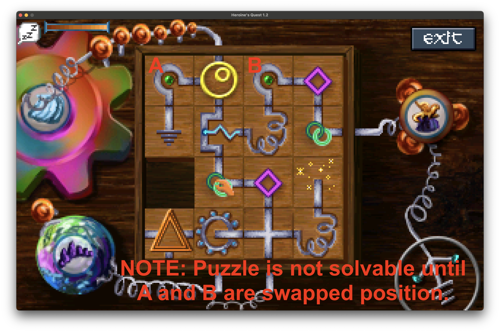

# 15_puzzle_pipe_solver

## Description
Given a 15 Puzzle with connecting pipes, exhaustively find all possible solutions. Useful for solving a puzzle in the game Heroine's Quest.s

## Puzzle Constraints

The puzzle board is a 4x4 grid, with fixed-position pipes on the outside. We must find an arrangement of pipes in the center such that:

* All tiles with a pipe connection on the edge connect to a valid pipe connection on an adjacent tile.
* All input and output pipes must be connected to each other -- no orphans. We solve this by picking one pipe on an edge and ensuring that a flood-fill algorithm will eventually travel to every space in the puzzle.

## Primary Script

The final script is in `solve_16patch.py`.

Our first attempt was a rather dumb brute-force approach that went through all possible permutations and checked them for validity.  However, this proved to be far too brute-force and would have taken days (or weeks) to fully execute.  Given the 20 quadrillion or so possible permutations, this was not a reasonable approach.  The original (and abandoned) brute-force attempt is cataloged in `first_attempt_solve_16patch_permutate.py`.

Our final version of the script is much faster, and should finish executing in less than a second.

## Program Output

```
 Starting with box:
╔═╤══╗
║XXXX║
║XXXX╢
║XXXX║
║XXXX║
╚═╧╧═╝

 Available tiles:
┌┌┐┐└└┘┘┤├┬┼╶╵╷

 Number of possible combinations of 16 tiles:
20922789888000

 Solving for potential solutions...
 ...done!
╔═╤══╗
║┌┤┌┐║
║╵├┘└╢
║ └┐╷║
║╶┬┼┘║
╚═╧╧═╝

 Found 1 solutions.
 ```

## Heroine's Quest

This program was written to help find a solution to a puzzle in the adventure game Heroine's Quest.  Rather than search online for answers, we elected to write a program to help us figure it out on our own.


## Unsolvable Dead-Ends

Note that because there are duplicate tiles, there are some arrangements that are unsolvable without swapping tiles.  If you find yourself in this predicament, try swapping some equivalent tiles around and you should be able to solve the puzzle.



To prove that this is unsolvable without rearranging other tiles, we wrote the script `sliding_solver.py`.
